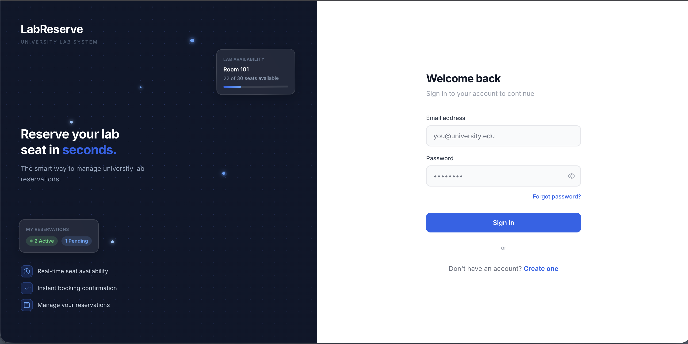
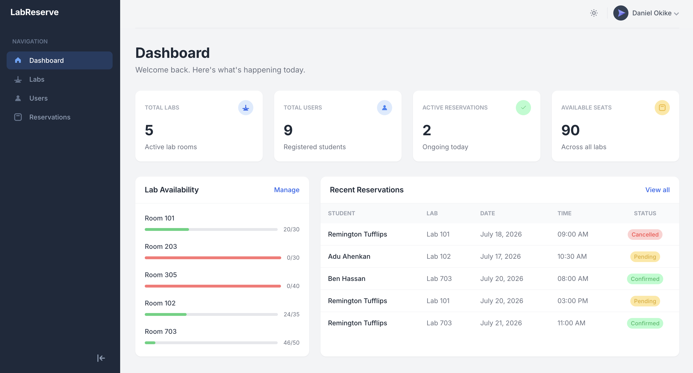
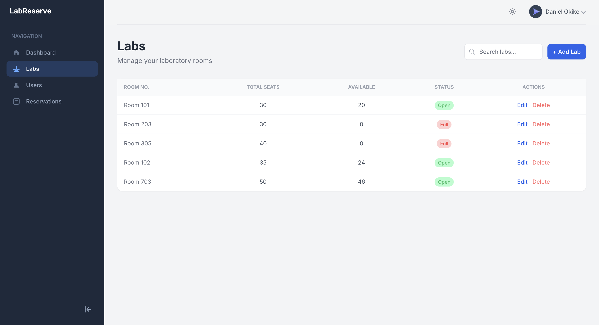
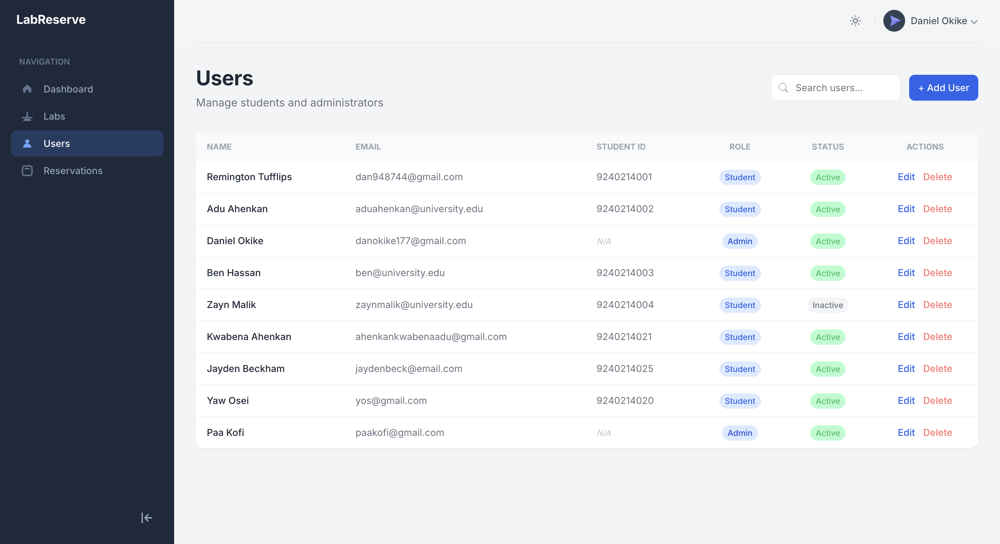
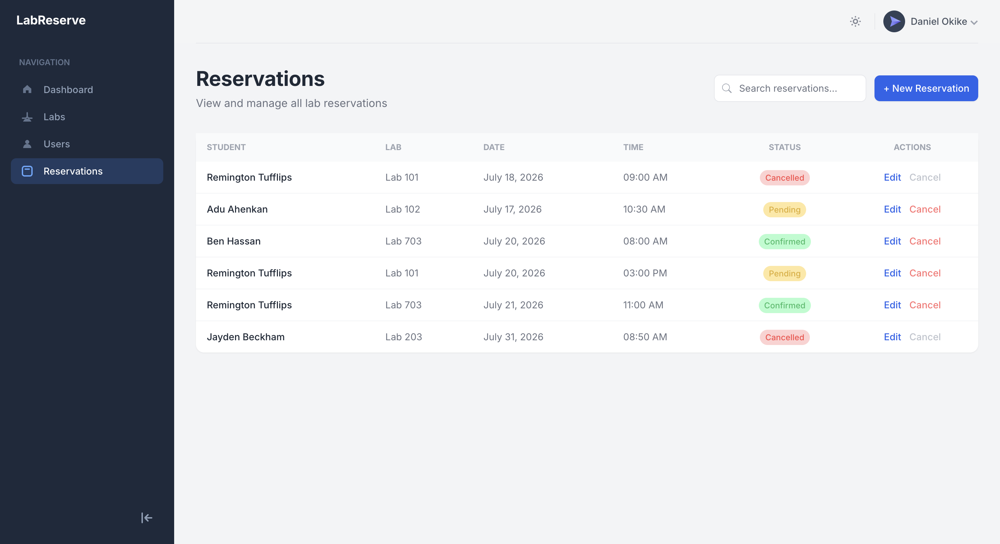
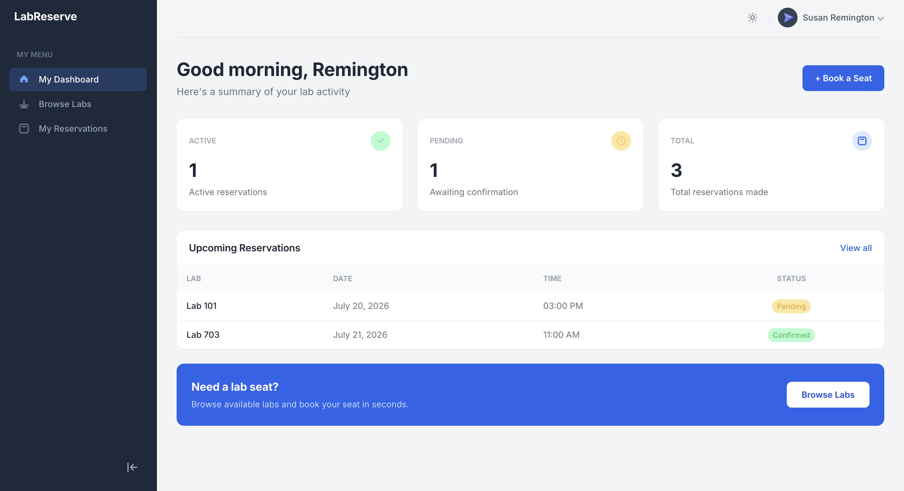
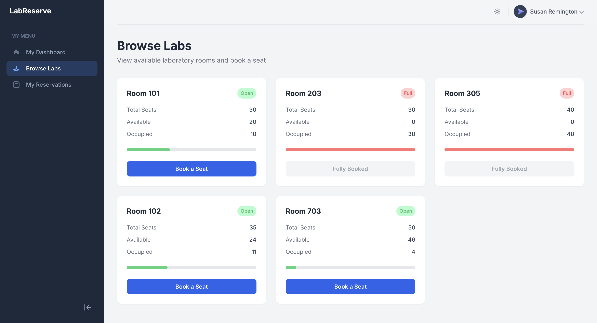
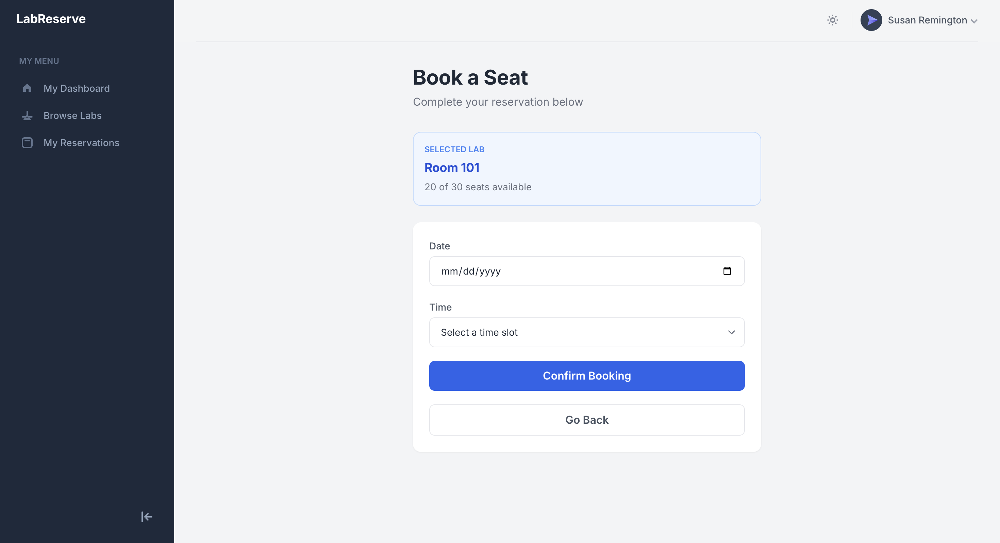

# Lab Reservation System

A full-stack web application for managing computer laboratory reservations within a university. Administrators manage labs and users, while students reserve seats in real time with automatic availability tracking and double-booking prevention.

## Screenshots

### Login



### Admin Dashboard



### Labs Management



### User Management



### Reservations Management



### Student Dashboard



### Browse Labs



### Book a Seat



## Features

**Laboratory management**

- Create, update, and delete lab records
- Track room number, total seats, and available seats
- Automatic status calculation (Open / Almost Full / Full) based on occupancy

**User management**

- Create, update, and delete user accounts
- Role-based accounts (Admin / Student)
- Student ID tracking for student accounts

**Reservation management**

- Create and cancel reservations
- Prevent duplicate active bookings for the same user and lab
- Automatic seat availability adjustment on booking and cancellation
- Reservation history retained after cancellation

**Authentication**

- JWT-based authentication
- Role-based route protection on the frontend
- Password reset via email

## Technology stack

**Frontend**

- React
- Tailwind CSS
- React Router
- Axios

**Backend**

- Django
- Django REST Framework
- Simple JWT

**Database**

- MySQL

## Architecture

The application follows a client-server architecture with a clear separation between presentation and business logic, maintained as two independent repositories.

The **frontend** is a React single-page application organized around role-based layouts (admin and student), each with its own navigation and set of pages. All communication with the backend goes through a centralized Axios instance that attaches authentication tokens automatically.

The **backend** is a Django REST Framework API exposing resource-based endpoints for labs, users, and reservations. Business rules, such as preventing double bookings and keeping seat counts consistent are enforced at the API layer rather than in the frontend, so the system behaves correctly regardless of client.

```
┌─────────────────┐        HTTPS/JSON        ┌──────────────────┐
│  React Frontend  │ ─────────────────────── │  Django REST API │
│  (Vite + Axios)  │                          │                  │
│  (separate repo) │                          │  (separate repo) │
└─────────────────┘                          └────────┬─────────┘
                                                        │
                                                  ┌─────▼─────┐
                                                  │   MySQL    │
                                                  └───────────┘
```

## Repositories

This project is split across two repositories:

| Repository                 | Description             | Link                                                        |
| -------------------------- | ----------------------- | ----------------------------------------------------------- |
| `lab-reservation-frontend` | React frontend          | [link](https://github.com/Kikson9/lab-reservation-frontend) |
| `lab-reservation-backend`  | Django REST API backend | [link](https://github.com/KbAhenkan/lab-reservation-system) |

Both repositories are required to run the full application. This README documents the frontend; refer to the backend repository's own README for backend-specific details.

## Project structure

**Frontend repository (`https://github.com/Kikson9/lab-reservation-frontend`)**

```
lab-reservation-frontend/
├── src/
│   ├── components/         # Reusable UI components (modals, dialogs, dropdowns)
│   ├── context/             # AuthContext for global auth state
│   ├── layouts/             # AppLayout (admin) and StudentLayout
│   ├── pages/
│   │   ├── student/         # Student-facing pages
│   │   ├── Dashboard.jsx
│   │   ├── Labs.jsx
│   │   ├── Users.jsx
│   │   ├── Reservations.jsx
│   │   ├── Login.jsx
│   │   ├── Signup.jsx
│   │   ├── ForgotPassword.jsx
│   │   └── ResetPassword.jsx
│   ├── partials/            # Sidebar, Header, StudentSidebar
│   ├── axios.js             # Configured Axios instance with interceptors
│   └── App.jsx              # Route definitions
├── public/
├── package.json
└── vite.config.js
```

**Backend repository (`https://github.com/KbAhenkan/lab-reservation-system`)**

```
lab-reservation-backend/
├── api/
│   ├── models.py            # User, Lab, Reservation
│   ├── serializers.py
│   ├── views.py
│   └── urls.py
├── lab_project/
│   ├── settings.py
│   └── urls.py
├── manage.py
└── requirements.txt
```

## Installation

Clone both repositories into separate directories:

```bash
git clone https://github.com/Kikson9/lab-reservation-frontend
git clone https://github.com/KbAhenkan/lab-reservation-system
```

The instructions below assume both repositories have been cloned side by side.

### Environment setup

Create a `.env` file in the root of the **backend** repository:

```
SECRET_KEY=your_django_secret_key
DB_PASSWORD=your_mysql_password
EMAIL_PASSWORD=your_gmail_app_password
```

The Gmail App Password must be entered as a single continuous string with no spaces, even though Google displays it in groups of four.

### Database setup

Create the MySQL database:

```sql
CREATE DATABASE labreserve;
```

### Running the backend

```bash
cd lab-reservation-backend
python -m venv venv
source venv/bin/activate   # Windows: venv\Scripts\activate
pip install -r requirements.txt
python manage.py migrate
python manage.py runserver
```

The API will be available at `http://127.0.0.1:8000/`.

### Running the frontend

```bash
cd lab-reservation-frontend
npm install
npm run dev
```

The application will be available at `http://localhost:5173/`.

Both servers must be running simultaneously for the application to function.

## API overview

All endpoints are prefixed with `/api/`.

| Method    | Endpoint                        | Description                        |
| --------- | ------------------------------- | ---------------------------------- |
| POST      | `/auth/signup/`                 | Register a new user                |
| POST      | `/auth/login/`                  | Authenticate and receive a JWT     |
| POST      | `/auth/password-reset/`         | Request a password reset email     |
| POST      | `/auth/password-reset/confirm/` | Reset password using emailed token |
| GET       | `/labs/`                        | List all labs                      |
| POST      | `/labs/`                        | Create a lab (admin only)          |
| PUT       | `/labs/:id/`                    | Update a lab (admin only)          |
| DELETE    | `/labs/:id/`                    | Delete a lab (admin only)          |
| GET       | `/users/`                       | List all users (admin only)        |
| POST      | `/users/`                       | Create a user (admin only)         |
| PUT       | `/users/:id/`                   | Update a user (admin only)         |
| DELETE    | `/users/:id/`                   | Delete a user (admin only)         |
| GET       | `/reservations/`                | List reservations                  |
| POST      | `/reservations/`                | Create a reservation               |
| PUT/PATCH | `/reservations/:id/`            | Update or cancel a reservation     |
| DELETE    | `/reservations/:id/`            | Delete a reservation               |
| GET       | `/dashboard/`                   | Aggregate stats (admin only)       |

Authenticated requests must include an `Authorization: Bearer <token>` header.

## Usage

The system supports two roles with distinct experiences:

**Administrators** manage the lab inventory, oversee user accounts, and have full visibility into all reservations across the system, with search and filtering on every management page.

**Students** browse available labs with live seat counts, book a seat for a specific date and time, and manage their own reservation history, including cancellation.

## Contributing

This project was developed as a two-person collaborative effort, with the frontend and backend maintained as separate repositories. Issues and pull requests are welcome on either repository for anyone extending the project further.

## License

This project does not currently specify a license. If you intend to reuse or build upon this code, please contact the maintainers.

## Acknowledgements

Built as part of a university software engineering course, with the frontend and backend developed and integrated collaboratively by the two contributing developers.
